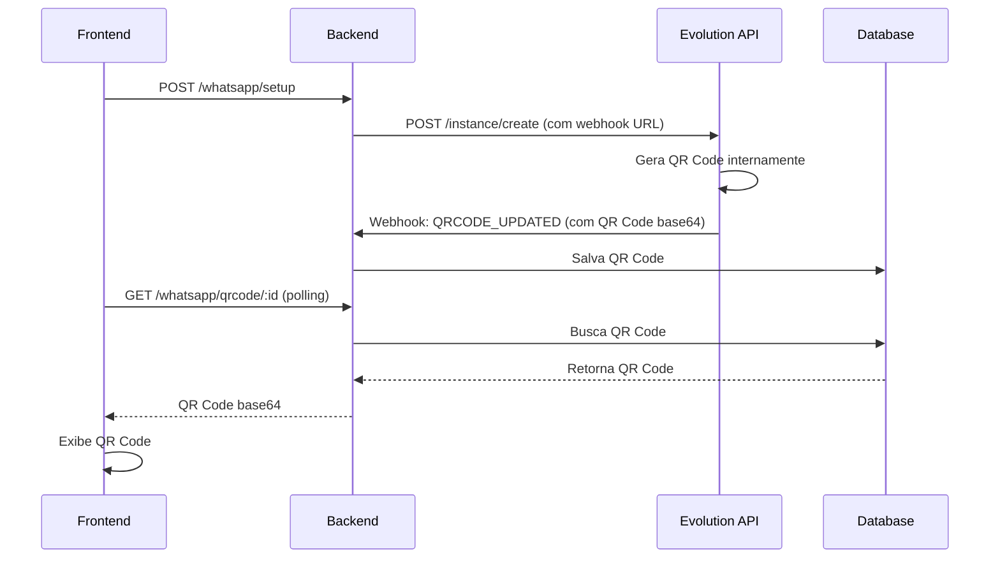

# Correção: QR Code não estava sendo gerado

## Problema Identificado

O frontend estava fazendo polling para obter o QR Code, mas o backend sempre retornava `qr_code: null`.

**Causa raiz:** O backend estava tentando obter o QR Code via GET do endpoint `/instance/connect/{instance}` da Evolution API, mas **este endpoint não retorna QR Code**.

Segundo a documentação da Evolution API v2, o QR Code é enviado via **webhook** com o evento `QRCODE_UPDATED`, não via endpoint GET.

## Solução Implementada

### 1. Arquitetura Webhook-Based

A Evolution API funciona assim:
1. Quando você cria uma instância com `qrcode: true`
2. A Evolution API **gera o QR Code** internamente
3. Envia o QR Code via **webhook** com evento `QRCODE_UPDATED`
4. O backend deve **salvar** o QR Code no banco de dados
5. O frontend faz polling **no banco de dados** (não na Evolution API)

### 2. Mudanças Implementadas

#### `evolution-api.provider.ts`
- ✅ Removido polling inútil do endpoint `/instance/connect`
- ✅ Adicionado `webhookByEvents: true` ao criar instância
- ✅ Configurado evento `QRCODE_UPDATED` nos webhooks
- ✅ Atualizado `processWebhook()` para processar evento `qrcode`

#### `whatsapp.service.ts`
- ✅ Configurado webhook URL automaticamente ao criar instância
- ✅ Implementado `handleQRCodeEvent()` para salvar QR Code no banco
- ✅ Modificado `getQRCode()` para buscar do banco ao invés do provider

#### `whatsapp-provider.interface.ts`
- ✅ Adicionado tipo `'qrcode'` no retorno de `processWebhook()`

### 3. Fluxo Correto



## Configuração Necessária

### 1. Variável de Ambiente

Adicione no `.env`:

```env
# URL pública do backend (para Evolution API enviar webhooks)
APP_URL=http://localhost:3000
```

**⚠️ IMPORTANTE:** Para produção ou desenvolvimento com Evolution API em outro servidor, você precisa de uma URL pública. Use ngrok ou similar para desenvolvimento local:

```bash
# Instalar ngrok
npm install -g ngrok

# Expor porta 3000
ngrok http 3000
```

Depois, copie a URL do ngrok e configure:
```env
APP_URL=https://abc123.ngrok.io
```

### 2. Webhook da Evolution API

O webhook é configurado automaticamente ao criar a instância. A URL será:
```
http://localhost:3000/api/v1/whatsapp/webhook
```

## Testando a Solução

### 1. Verificar Evolution API está rodando

```bash
curl http://localhost:8080/
```

Deve retornar:
```json
{
  "status": 200,
  "message": "Welcome to the Evolution API, it is working!"
}
```

### 2. Criar instância e verificar webhook

```bash
# 1. Criar instância
curl -X POST http://localhost:3000/api/v1/whatsapp/setup \
  -H "Authorization: Bearer SEU_TOKEN" \
  -H "Content-Type: application/json" \
  -d '{
    "instanceName": "test_webhook",
    "name": "Test"
  }'

# 2. Verificar logs do backend
# Deve aparecer: "📡 QR Code será enviado via webhook (evento QRCODE_UPDATED)"

# 3. Aguardar webhook (alguns segundos)
# Deve aparecer: "🔥 QR Code recebido via webhook!"
# Deve aparecer: "✅ QR Code salvo no banco para number_id: X"

# 4. Buscar QR Code
curl -X GET http://localhost:3000/api/v1/whatsapp/qrcode/ID_DO_NUMERO \
  -H "Authorization: Bearer SEU_TOKEN"
```

### 3. Verificar banco de dados

```sql
SELECT id, name, instance, qrcode IS NOT NULL as has_qrcode
FROM numbers
ORDER BY id DESC
LIMIT 5;
```

## Troubleshooting

### QR Code não está sendo recebido via webhook

**Causa:** Evolution API não consegue acessar a URL do backend

**Soluções:**
1. Usar ngrok para expor localhost publicamente
2. Verificar firewall/rede permite Evolution API acessar backend
3. Verificar logs da Evolution API:
   ```bash
   docker logs evolution-api
   ```

### Webhook retorna erro 401

**Causa:** O endpoint webhook está protegido por autenticação

**Solução:** O endpoint `/api/v1/whatsapp/webhook` já é público (não tem `@UseGuards`). Verifique se não há middleware global bloqueando.

### QR Code vem null no banco

**Causa:** Evento webhook não está sendo processado corretamente

**Solução:** Verificar logs do backend:
```bash
# Deve aparecer:
# 📥 Webhook recebido { event: 'qrcode.updated' }
# 🔥 QR Code recebido via webhook!
# ✅ QR Code salvo no banco para number_id: X
```

## Referências

- Evolution API v2 Docs: https://doc.evolution-api.com/v2
- Webhook Events: https://doc.evolution-api.com/v2/api-reference/webhook/set
- Event QRCODE_UPDATED: https://doc.evolution-api.com/v2/api-reference/webhook/set#events

## Commits Relacionados

- feat: implement webhook-based QR code handling
- fix: remove polling from Evolution API connect endpoint
- docs: add QR code webhook architecture documentation
