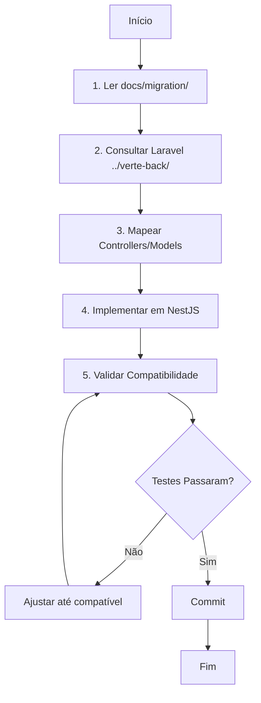

# agents.md

Instruções para Agentes de IA trabalhando na migração Laravel → NestJS do projeto Verte.

---

## 🎯 Objetivo do Projeto

**Migrar o backend Verte de Laravel 8 para NestJS 10 mantendo compatibilidade 100%.**

Este é um projeto de **MIGRAÇÃO**, não de reescrita. O frontend e o banco de dados **NÃO DEVEM SER ALTERADOS**.

---

## 🚨 Regras Críticas Invioláveis

### 1. CONSULTA OBRIGATÓRIA AO PROJETO ORIGINAL

**SEMPRE consulte o projeto Laravel localizado em `../verte-back/` antes de implementar qualquer funcionalidade.**

```bash
# Estrutura de diretórios:
workspace/
├── verte-back/          # Projeto Laravel ORIGINAL (fonte da verdade)
│   ├── app/
│   ├── routes/
│   ├── database/
│   └── docs/migration/  # Documentação master
│
└── verte-nestjs/        # Projeto NestJS NOVO (este repositório)
    ├── src/
    ├── test/
    └── docs/            # Cópia da documentação
```

### 2. COMPATIBILIDADE 100% OBRIGATÓRIA

| Item | Obrigação |
|------|-----------|
| **Rotas** | URIs idênticas (todas as 121 rotas) |
| **Banco de Dados** | MESMO banco, MESMAS tabelas (22+) |
| **Responses** | Estrutura JSON idêntica |
| **Validações** | Mensagens em português idênticas |
| **Status Codes** | Códigos HTTP idênticos (200, 201, 422, etc.) |
| **Autenticação** | Tokens JWT compatíveis com Sanctum |
| **Relacionamentos** | Mesmos relacionamentos do Eloquent |

### 3. IMPACTO ZERO NO FRONTEND

O frontend **NÃO DEVE PRECISAR DE NENHUMA ALTERAÇÃO** para funcionar com a API NestJS.

---

## 📋 Workflow de Desenvolvimento

### Processo de Implementação de Qualquer Funcionalidade



### Checklist por Endpoint

Antes de marcar um endpoint como completo:

- [ ] **Documentação lida**: Consultar `docs/migration/routes-inventory.md`
- [ ] **Laravel consultado**: Ler controller correspondente em `../verte-back/`
- [ ] **Rota idêntica**: URI exatamente igual
- [ ] **Validações idênticas**: Mensagens em português iguais
- [ ] **Response idêntico**: Estrutura JSON igual
- [ ] **Status codes idênticos**: Códigos HTTP iguais
- [ ] **Testes E2E escritos**: Validar compatibilidade
- [ ] **Testes passando**: 100% de compatibilidade

---

## 📚 Documentação de Referência

### Documentos Essenciais (Ler Antes de Começar)

1. **`docs/migration/README.md`**
   - Visão geral da migração
   - Estratégia em 5 fases
   - Estatísticas do projeto (121 rotas, 22+ tabelas)

2. **`docs/migration/routes-inventory.md`**
   - Inventário completo de todas as 121 rotas
   - Validações por rota
   - Estrutura de responses

3. **`docs/migration/business-rules.md`**
   - Lógica de negócio detalhada
   - Fluxos de processamento
   - Regras de validação específicas

4. **`docs/migration/database-schema.md`**
   - Estrutura das 22+ tabelas
   - Relacionamentos
   - Indexes e constraints

5. **`docs/migration/models-relationships.md`**
   - Modelos Laravel
   - Mapeamento para TypeORM
   - Relacionamentos preservados

6. **`docs/migration-specs/migration-master-spec.md`**
   - **REGRAS CRÍTICAS INVIOLÁVEIS**
   - Mapeamento Laravel → NestJS obrigatório
   - Templates de código

### Ordem de Leitura Recomendada

```bash
# Para começar:
1. docs/migration/README.md
2. docs/migration-specs/migration-master-spec.md

# Para implementar módulo específico:
1. docs/migration/routes-inventory.md (seção do módulo)
2. docs/migration/business-rules.md (seção do módulo)
3. docs/migration/models-relationships.md (models relacionados)
4. ../verte-back/app/Http/Controllers/[Controller].php
5. ../verte-back/app/Models/[Model].php
```

---

## 🔍 Como Consultar o Projeto Laravel

### Localização de Arquivos

| Componente | Laravel (`../verte-back/`) | NestJS (este repo) |
|------------|----------------------------|-------------------|
| Controllers | `app/Http/Controllers/` | `src/[module]/[module].controller.ts` |
| Models | `app/Models/` | `src/database/entities/[model].entity.ts` |
| Requests | `app/Http/Requests/` | `src/[module]/dto/[dto].dto.ts` |
| Jobs | `app/Jobs/` | `src/[module]/processors/[job].processor.ts` |
| Middleware | `app/Http/Middleware/` | `src/common/guards/[guard].guard.ts` |
| Routes | `routes/api.php` | `src/[module]/[module].controller.ts` decorators |

### Exemplo Prático de Consulta

**Cenário**: Implementar endpoint `POST /api/v1/campaigns`

```bash
# 1. Ler documentação
cat docs/migration/routes-inventory.md | grep -A 20 "POST /api/v1/campaigns"
cat docs/migration/business-rules.md | grep -A 50 "POST /api/v1/campaigns"

# 2. Consultar Laravel
cat ../verte-back/app/Http/Controllers/CampaignsController.php | grep -A 100 "function store"
cat ../verte-back/app/Http/Requests/StoreCampaignRequest.php
cat ../verte-back/app/Models/Campaign.php

# 3. Verificar relacionamentos
cat ../verte-back/app/Models/Campaign.php | grep "public function"

# 4. Verificar Jobs relacionados
ls ../verte-back/app/Jobs/ | grep -i campaign
```

---

## 🛠️ Padrões de Implementação

### 1. Estrutura de Controllers

```typescript
// src/campaigns/campaigns.controller.ts

import { Controller, Post, Body, UseGuards, HttpCode } from '@nestjs/common';
import { JwtAuthGuard } from '../common/guards/jwt-auth.guard';
import { CreateCampaignDto } from './dto/create-campaign.dto';

@Controller('api/v1/campaigns') // URI IDÊNTICA ao Laravel
@UseGuards(JwtAuthGuard)
export class CampaignsController {
  constructor(private readonly campaignsService: CampaignsService) {}

  @Post()
  @HttpCode(201) // Status code IDÊNTICO ao Laravel
  async store(@Body() createCampaignDto: CreateCampaignDto) {
    const campaign = await this.campaignsService.create(createCampaignDto);

    // Response IDÊNTICO ao Laravel
    return {
      data: campaign,
      message: 'Campanha criada com sucesso'
    };
  }
}
```

### 2. DTOs com Validações

**Consultar Laravel Request equivalente primeiro!**

```typescript
// src/campaigns/dto/create-campaign.dto.ts

// SEMPRE consultar ../verte-back/app/Http/Requests/StoreCampaignRequest.php

import { IsNotEmpty, IsString, MaxLength, IsInt, Min } from 'class-validator';

export class CreateCampaignDto {
  // Laravel: 'name' => 'required|string|max:150'
  @IsNotEmpty({ message: 'O campo nome é obrigatório.' })
  @IsString({ message: 'O campo nome deve ser uma string.' })
  @MaxLength(150, { message: 'O campo nome não pode ter mais de 150 caracteres.' })
  name: string;

  // Laravel: 'timer' => 'required|integer|min:1|max:300'
  @IsNotEmpty({ message: 'O campo timer é obrigatório.' })
  @IsInt({ message: 'O campo timer deve ser um número inteiro.' })
  @Min(1, { message: 'O campo timer deve ser no mínimo 1.' })
  timer: number;
}
```

### 3. Entities TypeORM

**Mapear tabelas EXISTENTES, NUNCA criar novas!**

```typescript
// src/database/entities/campaign.entity.ts

// SEMPRE consultar ../verte-back/app/Models/Campaign.php
// E também docs/migration/database-schema.md

import { Entity, PrimaryGeneratedColumn, Column, ManyToOne, OneToMany } from 'typeorm';

@Entity('campaigns') // Nome da tabela EXISTENTE no MySQL
export class Campaign {
  @PrimaryGeneratedColumn()
  id: number;

  @Column({ type: 'bigint', name: 'user_id' })
  userId: number;

  @Column({ length: 150 })
  name: string;

  // Soft deletes (como Laravel)
  @DeleteDateColumn({ name: 'deleted_at' })
  deletedAt?: Date;

  // Timestamps (como Laravel)
  @CreateDateColumn({ name: 'created_at', type: 'timestamp' })
  createdAt: Date;

  @UpdateDateColumn({ name: 'updated_at', type: 'timestamp' })
  updatedAt: Date;

  // Relacionamentos (como Eloquent)
  @ManyToOne(() => User, user => user.campaigns)
  user: User;

  @OneToMany(() => Message, message => message.campaign)
  messages: Message[];
}
```

### 4. Services com Lógica de Negócio

**Replicar EXATAMENTE a lógica do Laravel!**

```typescript
// src/campaigns/campaigns.service.ts

// SEMPRE consultar:
// - ../verte-back/app/Http/Controllers/CampaignsController.php
// - docs/migration/business-rules.md

@Injectable()
export class CampaignsService {
  constructor(
    @InjectRepository(Campaign)
    private campaignRepository: Repository<Campaign>,
    private whatsappService: WhatsappService,
    @InjectQueue('campaigns') private campaignQueue: Queue,
  ) {}

  async create(createCampaignDto: CreateCampaignDto, userId: number) {
    // 1. Validações de negócio (IDÊNTICAS ao Laravel)
    const number = await this.whatsappService.getActiveNumber(userId);
    if (!number || !number.status_connection) {
      throw new BadRequestException('Número WhatsApp não conectado');
    }

    // 2. Verificar limite do plano (IDÊNTICO ao Laravel)
    const user = await this.userRepository.findOne({ where: { id: userId }, relations: ['plan'] });
    const activeCampaigns = await this.campaignRepository.count({
      where: { userId, status: 0 }
    });

    if (activeCampaigns >= user.plan.limit_campaigns) {
      throw new BadRequestException('Limite de campanhas excedido para seu plano');
    }

    // 3. Criar campanha (IDÊNTICO ao Laravel)
    const campaign = this.campaignRepository.create({
      ...createCampaignDto,
      userId,
      status: createCampaignDto.schedule_date ? 3 : 0,
    });

    await this.campaignRepository.save(campaign);

    // 4. Enfileirar processamento (equivalente ao Laravel Queue)
    if (!campaign.schedule_date) {
      await this.campaignQueue.add('process-campaign', {
        campaignId: campaign.id,
        timer: createCampaignDto.timer,
      });
    }

    return campaign;
  }
}
```

---

## 🧪 Testes de Compatibilidade

### Estrutura de Testes E2E

```typescript
// test/campaigns/campaigns.e2e-spec.ts

describe('Campaigns Compatibility Tests', () => {
  let app: INestApplication;

  beforeEach(async () => {
    const moduleFixture = await Test.createTestingModule({
      imports: [AppModule],
    }).compile();

    app = moduleFixture.createNestApplication();
    await app.init();
  });

  it('POST /api/v1/campaigns - should return Laravel-compatible response', async () => {
    const validData = {
      name: 'Campanha Teste',
      number_id: 1,
      public_id: 1,
      messages: [{ message: 'Olá!', type: 0 }],
      timer: 30
    };

    const response = await request(app.getHttpServer())
      .post('/api/v1/campaigns')
      .set('Authorization', 'Bearer valid-token')
      .send(validData)
      .expect(201);

    // Validar estrutura IDÊNTICA ao Laravel
    expect(response.body).toHaveProperty('data');
    expect(response.body).toHaveProperty('message');
    expect(response.body.message).toBe('Campanha criada com sucesso');
    expect(response.body.data).toHaveProperty('id');
    expect(response.body.data).toHaveProperty('name');
    expect(response.body.data.name).toBe(validData.name);
  });

  it('should return identical validation errors', async () => {
    const invalidData = {
      name: '', // required
      timer: 0  // min:1
    };

    const response = await request(app.getHttpServer())
      .post('/api/v1/campaigns')
      .set('Authorization', 'Bearer valid-token')
      .send(invalidData)
      .expect(422);

    // Validar mensagens IDÊNTICAS ao Laravel
    expect(response.body.message).toBe('Os dados fornecidos são inválidos.');
    expect(response.body.errors.name).toContain('O campo nome é obrigatório.');
    expect(response.body.errors.timer).toContain('O campo timer deve ser no mínimo 1.');
  });
});
```

---

## 📊 Mapeamento de Componentes

### Laravel → NestJS

| Laravel | NestJS | Notas |
|---------|--------|-------|
| `Route::get()` | `@Get()` decorator | URI idêntica |
| `Route::post()` | `@Post()` decorator | URI idêntica |
| `FormRequest` | DTO com `class-validator` | Mensagens idênticas |
| `Model::find()` | `repository.findOne()` | Mesma tabela |
| `Model::create()` | `repository.save()` | Mesma estrutura |
| `$model->save()` | `repository.save(entity)` | Mesmos campos |
| `dispatch(Job)` | `queue.add()` | Mesma lógica |
| `auth:sanctum` | `@UseGuards(JwtAuthGuard)` | JWT compatível |
| `Eloquent Relations` | TypeORM Relations | Mesmos relacionamentos |
| `SoftDeletes` | `@DeleteDateColumn()` | Mesmo comportamento |
| `Event::dispatch()` | `eventEmitter.emit()` | Mesmos eventos |

### Validações Laravel → NestJS

| Laravel Rule | NestJS Decorator | Mensagem |
|--------------|------------------|----------|
| `required` | `@IsNotEmpty()` | "O campo X é obrigatório." |
| `email` | `@IsEmail()` | "O campo X deve ser um email válido." |
| `min:8` | `@MinLength(8)` | "O campo X deve ter pelo menos 8 caracteres." |
| `max:255` | `@MaxLength(255)` | "O campo X não pode ter mais de 255 caracteres." |
| `unique:users,email` | `@IsUnique()` custom | "O campo X já está sendo utilizado." |
| `confirmed` | `@IsConfirmed()` custom | "A confirmação de X não confere." |
| `integer` | `@IsInt()` | "O campo X deve ser um número inteiro." |

---

## ⚠️ Erros Comuns a Evitar

### ❌ NÃO FAÇA

1. **Alterar URIs de rotas**
   ```typescript
   // ❌ ERRADO
   @Get('campaigns') // Laravel usa /api/v1/campaigns

   // ✅ CORRETO
   @Get('api/v1/campaigns')
   ```

2. **Criar novas tabelas**
   ```typescript
   // ❌ ERRADO
   @Entity('campaigns_new') // Tabela não existe no Laravel

   // ✅ CORRETO
   @Entity('campaigns') // Tabela existente
   ```

3. **Alterar estrutura de responses**
   ```typescript
   // ❌ ERRADO
   return { success: true, result: data };

   // ✅ CORRETO (como Laravel)
   return { data: data, message: 'Operação realizada com sucesso' };
   ```

4. **Mudar mensagens de validação**
   ```typescript
   // ❌ ERRADO
   @IsNotEmpty({ message: 'Name is required' })

   // ✅ CORRETO (como Laravel)
   @IsNotEmpty({ message: 'O campo nome é obrigatório.' })
   ```

5. **Usar diferentes status codes**
   ```typescript
   // ❌ ERRADO
   @HttpCode(400) // Laravel usa 422 para validação

   // ✅ CORRETO
   @HttpCode(422)
   ```

### ✅ SEMPRE FAÇA

1. **Consultar Laravel antes de implementar**
2. **Ler documentação em docs/migration/**
3. **Manter compatibilidade 100%**
4. **Escrever testes E2E**
5. **Validar responses idênticos**
6. **Preservar mensagens em português**
7. **Usar mesmo banco de dados**

---

## 🗺️ Roadmap de Migração

### Fase 1: Infraestrutura (Semana 1)
- [x] Setup NestJS base
- [ ] Configurar TypeORM (mesmo banco)
- [ ] Configurar JWT (compatível com Sanctum)
- [ ] Configurar Redis
- [ ] Configurar Bull Queue

### Fase 2: Core Business (Semanas 2-3)
- [ ] Módulo de Autenticação (6 endpoints)
- [ ] Módulo de Usuários (13 endpoints)
- [ ] Módulo de Campanhas (21 endpoints)
- [ ] Módulo de Contatos (11 endpoints)

### Fase 3: Integrações (Semana 4)
- [ ] Integração WAHA (15 endpoints)
- [ ] Pagamentos Stripe/MercadoPago (5 endpoints)
- [ ] Email service
- [ ] File storage

### Fase 4: Admin & Utils (Semana 5)
- [ ] Endpoints administrativos (16 endpoints)
- [ ] Planos e assinaturas (8 endpoints)
- [ ] Públicos e labels (8 endpoints)
- [ ] Utilidades e testes (24 endpoints)

### Fase 5: Testes & Deploy (Semana 6)
- [ ] Testes de compatibilidade (100%)
- [ ] Performance testing
- [ ] Documentation final
- [ ] Production deployment

---

## 📞 Referências Rápidas

### Consultar Sempre

1. **Projeto Laravel**: `../verte-back/`
2. **Docs de Migração**: `docs/migration/README.md`
3. **Regras Críticas**: `docs/migration-specs/migration-master-spec.md`
4. **Inventário de Rotas**: `docs/migration/routes-inventory.md`
5. **Regras de Negócio**: `docs/migration/business-rules.md`

### Comandos Úteis

```bash
# Comparar endpoint com Laravel
npm run compare:endpoint -- --route=/api/v1/login

# Testar compatibilidade
npm run test:compat

# Gerar relatório de diferenças
npm run diff:report

# Ver status da migração
npm run migration:status
```

---

## 🎯 Critérios de Sucesso

Um endpoint está completo quando:

✅ URI idêntica ao Laravel
✅ Validações idênticas (mensagens em português)
✅ Response JSON idêntico
✅ Status codes idênticos
✅ Testes E2E passando 100%
✅ Documentado no código
✅ Sem alterações no banco de dados
✅ Frontend funciona sem alterações

---

## 📝 Lembrete Final

🚨 **Este é um projeto de MIGRAÇÃO, não de reescrita.**

**Objetivo**: Trocar Laravel por NestJS mantendo tudo funcionando EXATAMENTE IGUAL.

**Meta**: Frontend não percebe diferença nenhuma na API.

**Quando em dúvida**: SEMPRE consulte `../verte-back/` e a documentação.

---

**Boa migração! 🚀**
