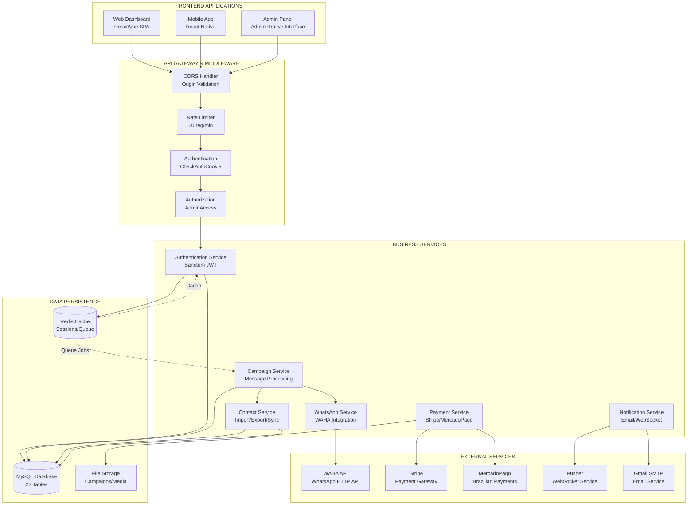
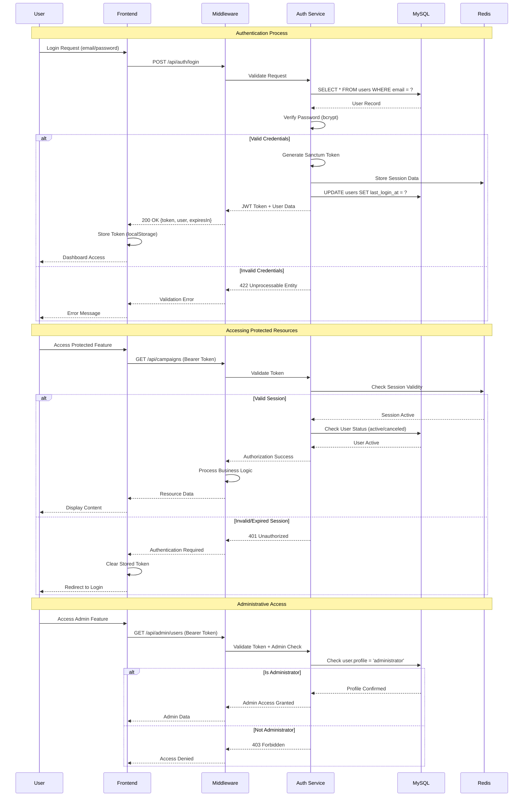
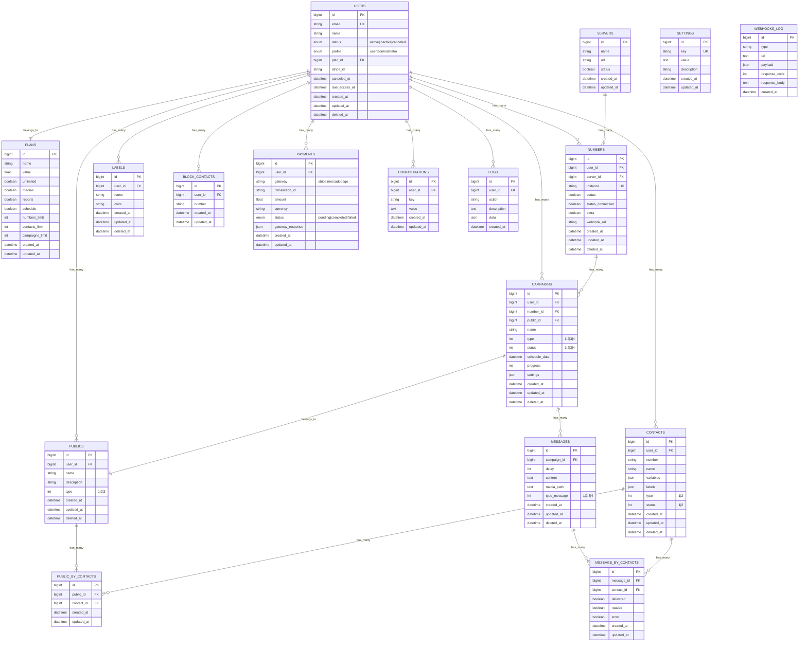
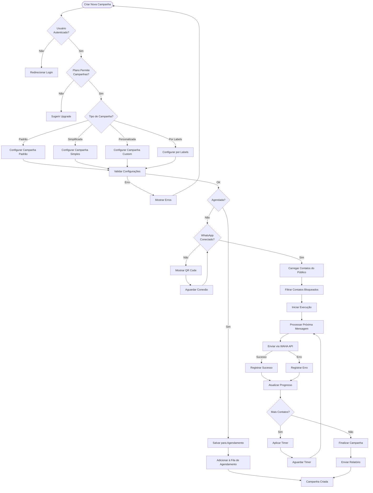
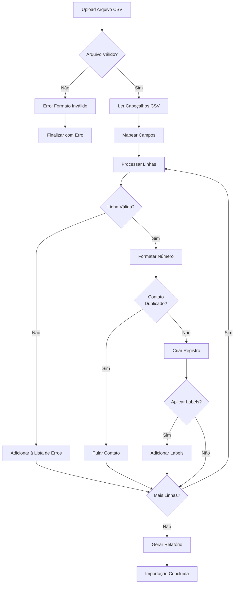
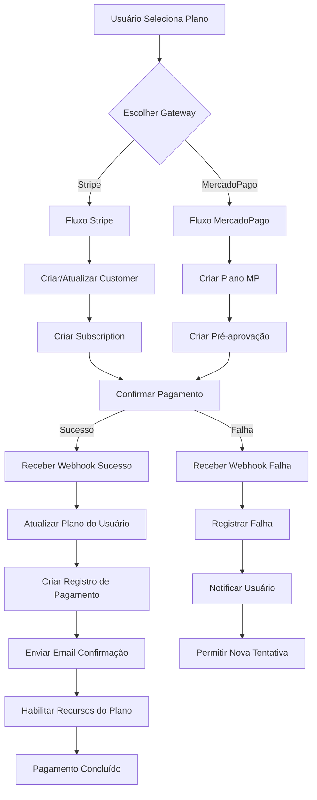
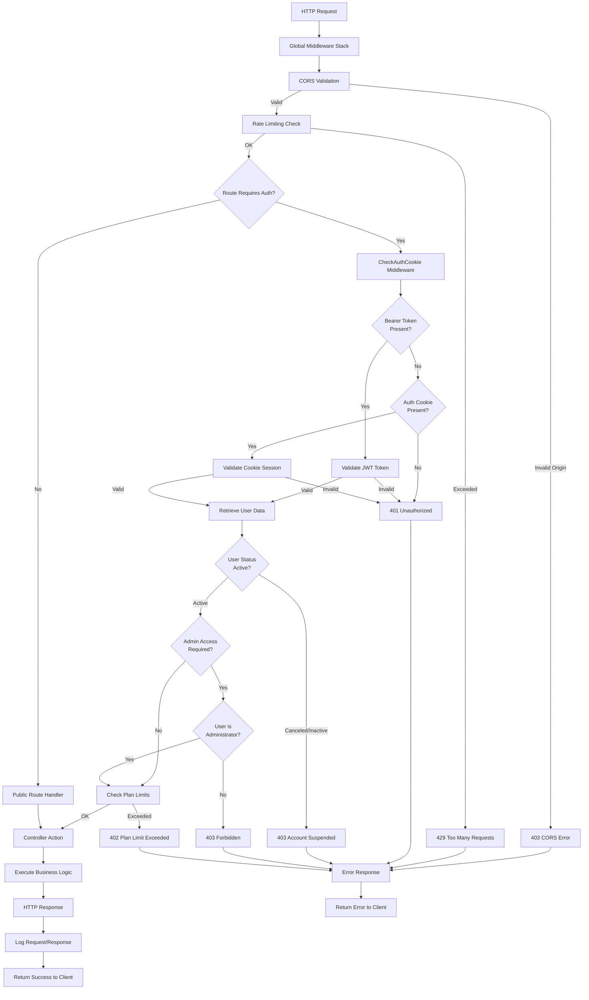

# FLOWCHARTS MERMAID - ANÁLISE VISUAL DO PROJETO

## 1. Arquitetura Geral do Sistema



## 2. Fluxo de Autenticação Detalhado



## 3. Relacionamentos de Entidades (ERD)



## 4. Fluxos de Negócio Principais

### 4.1 Fluxo de Execução de Campanha



### 4.2 Fluxo de Importação de Contatos



### 4.3 Fluxo de Processamento de Pagamentos



## 5. Mapa de Integrações Externas

```mermaid
graph TB
    subgraph "APLICAÇÃO LARAVEL"
        API[API Gateway<br/>Laravel Routes]
        SERVICES[Business Services<br/>Campaign/Contact/Payment]
        JOBS[Background Jobs<br/>Laravel Queue]
        WEBHOOKS[Webhook Handlers<br/>Payment/WhatsApp Events]
    end
    
    subgraph "WHATSAPP INTEGRATION"
        WAHA[WAHA API<br/>http://waha:8080]
        EVOLUTION[Evolution API<br/>Legacy Support]
    end
    
    subgraph "PAYMENT GATEWAYS"
        STRIPE[Stripe API<br/>stripe.com]
        MERCADOPAGO[MercadoPago API<br/>api.mercadopago.com]
    end
    
    subgraph "COMMUNICATION SERVICES"
        PUSHER[Pusher WebSockets<br/>Real-time Events]
        GMAIL[Gmail SMTP<br/>Email Notifications]
    end
    
    subgraph "STORAGE & INFRASTRUCTURE"
        REDIS[(Redis<br/>Cache & Queue)]
        MYSQL[(MySQL Database<br/>Persistent Data)]
        STORAGE[Local File Storage<br/>Campaign Media]
    end
    
    %% API Connections
    API --> SERVICES
    API --> WEBHOOKS
    SERVICES --> JOBS
    
    %% WhatsApp Integration
    SERVICES -->|REST API| WAHA
    WAHA -->|Webhooks| WEBHOOKS
    SERVICES -->|Legacy| EVOLUTION
    
    %% Payment Integration
    SERVICES -->|Create Customer<br/>Create Subscription| STRIPE
    STRIPE -->|payment_intent.succeeded<br/>customer.subscription.deleted| WEBHOOKS
    
    SERVICES -->|Create Plan<br/>Create Preapproval| MERCADOPAGO
    MERCADOPAGO -->|subscription_preapproval| WEBHOOKS
    
    %% Communication
    SERVICES -->|Trigger Events| PUSHER
    SERVICES -->|Send Emails| GMAIL
    
    %% Data Storage
    SERVICES --> REDIS
    SERVICES --> MYSQL
    JOBS --> STORAGE
    
    %% Configuration Details
    WAHA -.->|Config| WAHA_CONFIG[API Key: Optional<br/>Timeout: 600s<br/>Base URL: configurable]
    STRIPE -.->|Config| STRIPE_CONFIG[Secret Key: Required<br/>Webhook Secret: Required<br/>Test Mode Available]
    MERCADOPAGO -.->|Config| MP_CONFIG[Access Token: Required<br/>API URL: https://api.mercadopago.com<br/>Currency: BRL]
    PUSHER -.->|Config| PUSHER_CONFIG[App ID: 1880783<br/>Cluster: sa1<br/>Encrypted: true]
```



## 6. Fluxo de Middleware e Guards



## 7. Análise e Insights

### Padrões Arquiteturais Identificados

#### 1. **Arquitetura Monolítica Modular**
- **Separação clara** entre camadas de apresentação, negócio e dados
- **Módulos especializados** para cada domínio (autenticação, campanhas, pagamentos)
- **Comunicação via eventos** para desacoplamento entre módulos

#### 2. **Multi-tenancy por Isolamento de Dados**
- **Filtragem automática** por `user_id` em todas as consultas
- **Soft deletes** preservam integridade referencial
- **Configurações personalizáveis** por usuário

#### 3. **Integração Híbrida com APIs Externas**
- **WhatsApp**: HTTP REST + Webhooks bidirecionais
- **Pagamentos**: API calls + Event-driven webhooks
- **Notificações**: Push + Email com fallback

#### 4. **Sistema de Filas e Jobs Assíncronos**
- **Campaign processing** em background
- **Email notifications** via queue
- **Webhook processing** com retry logic

### Pontos Críticos para Migração NestJS

#### 1. **Autenticação e Sessões**
- **Laravel Sanctum** → **JWT Strategy com Guards**
- **Cookie + Bearer** → **JWT com refresh tokens**
- **Multi-device sessions** → **Token blacklisting**

#### 2. **ORM e Relacionamentos**
- **Eloquent** → **TypeORM com repositórios**
- **Soft deletes** → **Interceptors customizados**
- **Model events** → **Entity listeners**

#### 3. **Queue System**
- **Laravel Queue** → **Bull Queue com Redis**
- **Job classes** → **Processors com retry logic**
- **Failed jobs** → **Dead letter queues**

#### 4. **Validation e Form Requests**
- **Form Request classes** → **DTOs com class-validator**
- **Custom rules** → **Custom validators**
- **Error messages** → **Internationalization**

### Recomendações de Implementação

#### 1. **Estrutura Modular NestJS**
```
src/
├── auth/              # Autenticação e autorização
├── users/             # Gerenciamento de usuários
├── campaigns/         # Sistema de campanhas
├── contacts/          # Gerenciamento de contatos
├── payments/          # Processamento de pagamentos
├── whatsapp/          # Integração WhatsApp
├── notifications/     # Sistema de notificações
├── shared/            # Módulos compartilhados
└── config/            # Configurações da aplicação
```

#### 2. **Estratégia de Database**
- **Migrations TypeORM** baseadas no schema Laravel
- **Entities** espelhando os models Eloquent
- **Repositories** para abstração de acesso aos dados
- **Interceptors** para soft deletes e multi-tenancy

#### 3. **API Compatibility**
- **Manter estrutura** de endpoints idêntica
- **Response format** compatível com frontend
- **Error codes** e messages consistentes
- **Validation rules** equivalentes

Este mapeamento visual fornece uma base sólida para entender a arquitetura completa e facilitar a migração fidedigna do Laravel para NestJS, preservando toda a funcionalidade e comportamento do sistema original.