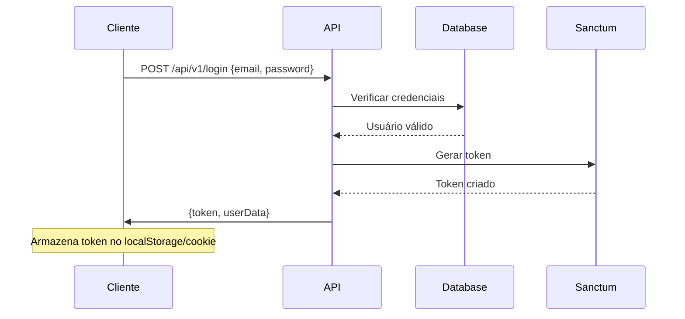
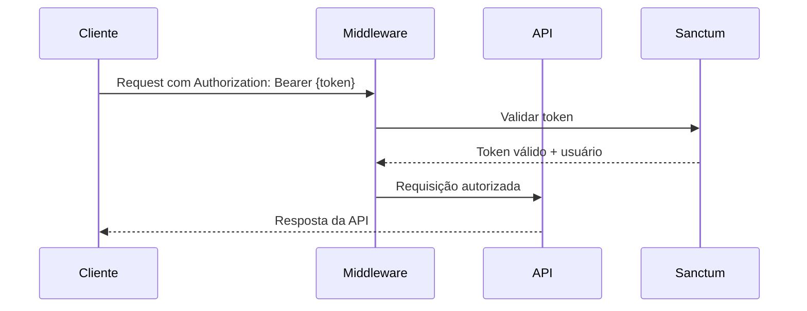
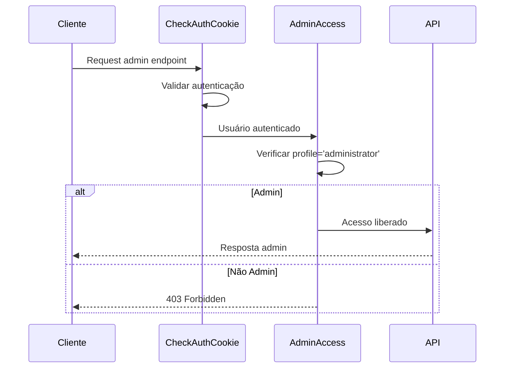

# MIDDLEWARE E AUTENTICAÇÃO

## Resumo do Sistema de Autenticação

O sistema utiliza **Laravel Sanctum** como base para autenticação de API, com middleware personalizados para controle de acesso específico do projeto.

### Características Principais
- **Autenticação via Sanctum** com tokens de acesso pessoal
- **Suporte a múltiplos métodos** de autenticação (Cookie + Bearer Token)
- **Controle de acesso granular** com middleware específicos
- **CORS configurado** para frontend SPA
- **Validação de permissões** por perfil de usuário

---

## Configuração de Autenticação

### config/auth.php
```php
'defaults' => [
    'guard' => 'web',
    'passwords' => 'users',
],

'guards' => [
    'web' => [
        'driver' => 'session',
        'provider' => 'users',
    ],
],

'providers' => [
    'users' => [
        'driver' => 'eloquent',
        'model' => App\Models\User::class,
    ],
],

'passwords' => [
    'users' => [
        'provider' => 'users',
        'table' => 'password_resets',
        'expire' => 60,        // 60 minutos para expirar
        'throttle' => 60,      // 60 segundos entre tentativas
    ],
],

'password_timeout' => 10800,   // 3 horas para confirmação de senha
```

### config/sanctum.php
```php
'stateful' => [
    'localhost',
    'localhost:3000',    // Frontend desenvolvimento
    'localhost:5009',    // Nginx Docker
    '127.0.0.1',
    '127.0.0.1:8000',
    '::1'
],

'guard' => ['web'],

'expiration' => null,    // Tokens não expiram automaticamente

'middleware' => [
    'verify_csrf_token' => App\Http\Middleware\VerifyCsrfToken::class,
    'encrypt_cookies' => App\Http\Middleware\EncryptCookies::class,
],
```

---

## Middleware Customizados

### 1. CheckAuthCookie (app/Http/Middleware/CheckAuthCookie.php)

#### Funcionalidade
Middleware principal para autenticação de API. Suporta autenticação via cookie e Bearer token.

#### Implementação
```php
<?php

namespace App\Http\Middleware;

use App\Models\User;
use Closure;
use Illuminate\Http\Request;
use Illuminate\Support\Facades\Auth;

class CheckAuthCookie
{
    public function handle($request, Closure $next)
    {
        // Se já está autenticado, prosseguir
        if (Auth::check()) {
            return $next($request);
        }

        $token = null;
        $authMethod = 'none';

        // 1. Tentar autenticar via cookie 'auth-token' primeiro
        if ($request->hasCookie('auth-token')) {
            $token = $request->cookie('auth-token');
            $authMethod = 'cookie';
        }
        // 2. Se não tiver cookie, tentar via header Authorization Bearer
        elseif ($request->hasHeader('Authorization')) {
            $authHeader = $request->header('Authorization');
            if (strpos($authHeader, 'Bearer ') === 0) {
                $token = substr($authHeader, 7); // Remove 'Bearer ' prefix
                $authMethod = 'bearer';
            }
        }

        if ($token) {
            // O token pode estar no formato "user_id|token"
            if (strpos($token, '|') !== false) {
                $tokenParts = explode('|', $token);
                $actualToken = end($tokenParts);
            } else {
                $actualToken = $token;
            }

            // Buscar usuário pelo token no Sanctum
            $personalAccessToken = \Laravel\Sanctum\PersonalAccessToken::findToken($actualToken);

            if ($personalAccessToken && $personalAccessToken->tokenable) {
                Auth::login($personalAccessToken->tokenable);
            }
        }

        // Se chegou até aqui e não está autenticado, rejeitar
        if (!Auth::check()) {
            return response()->json(['error' => 'Não autenticado'], 401);
        }

        return $next($request);
    }
}
```

#### Utilização
- Aplicado em **85 rotas** da API
- **Rotas protegidas**: Todas as operações de CRUD, dashboard, configurações
- **Métodos suportados**:
  - Cookie `auth-token` (prioridade 1)
  - Header `Authorization: Bearer {token}` (prioridade 2)

#### Response de Erro
```json
{
    "error": "Não autenticado"
}
```
**Status Code**: `401 Unauthorized`

---

### 2. AdminAccess (app/Http/Middleware/AdminAccess.php)

#### Funcionalidade
Middleware para restringir acesso apenas a usuários com perfil administrativo.

#### Implementação
```php
<?php

namespace App\Http\Middleware;

use Closure;
use Illuminate\Http\Request;

class AdminAccess
{
    public function handle(Request $request, Closure $next)
    {
        if (auth()->check() && auth()->user()->profile == 'administrator') {
            return $next($request);
        } else {
            return response()->json([
                "message" => "Não possui acesso de administrador para acessar essa rota."
            ], 403);
        }
    }
}
```

#### Utilização
- Aplicado em **16 rotas administrativas**
- **Rotas protegidas**:
  - `/api/v1/config/customers` (CRUD de clientes)
  - `/api/v1/config/dashboard` (indicadores admin)
  - `/api/v1/config/campaigns-all` (todas as campanhas)
  - `/api/v1/config/payments` (histórico de pagamentos)
  - `/api/v1/config/settings` (configurações globais)
  - `/api/v1/config/plans` (CRUD de planos)

#### Validação
- **Pré-requisito**: Usuário deve estar autenticado
- **Condição**: `user.profile === 'administrator'`

#### Response de Erro
```json
{
    "message": "Não possui acesso de administrador para acessar essa rota."
}
```
**Status Code**: `403 Forbidden`

---

### 3. CheckAuthCookieLogin (app/Http/Middleware/CheckAuthCookieLogin.php)

#### Funcionalidade
Middleware para autenticação em rotas web (frontend), usado principalmente na rota principal `/`.

#### Implementação
```php
<?php

namespace App\Http\Middleware;

use Closure;
use Illuminate\Http\Request;
use Illuminate\Support\Facades\Auth;
use Illuminate\Support\Facades\Cookie;
use Laravel\Sanctum\PersonalAccessToken;

class CheckAuthCookieLogin
{
    public function handle($request, Closure $next)
    {
        if (!empty($_COOKIE['auth-token'])) {
            $token = $_COOKIE['auth-token'];
        } else {
            $token = null;
            Auth::logout();
        }

        if ($token && !Auth::check()) {
            // Encontrar o token e verificar se existe um usuário associado
            $user = optional(PersonalAccessToken::findToken($token))->tokenable;

            // Verificar se o usuário é válido antes de tentar o login
            if ($user) {
                Auth::login($user);
            } else {
                // Se o token é inválido, fazer logout
                Auth::logout();
            }
        } elseif (Auth::check()) {
            // Definir cookie de sessão ativa
            if (empty($_COOKIE['logged'])) {
                setcookie('logged', 1, time() + (60 * 60), "/sistema");
            }
        }

        return $next($request);
    }
}
```

#### Utilização
- Aplicado na **rota web principal** `/`
- **Funcionalidade específica**: Auto-login silencioso via cookie
- **Cookie adicional**: Define `logged=1` para controle de sessão no frontend

---

### 4. HandleCors (app/Http/Middleware/HandleCors.php)

#### Funcionalidade
Middleware customizado para configuração CORS específica do projeto.

#### Implementação
```php
<?php

namespace App\Http\Middleware;

use Closure;
use Illuminate\Http\Request;

class HandleCors
{
    public function handle(Request $request, Closure $next)
    {
        // Lista de origens permitidas
        $allowed_origins = [
            'http://localhost:3000',    // Frontend desenvolvimento
            'https://w-verte.com.br'    // Frontend produção
        ];

        // Para requests OPTIONS, retornar resposta vazia
        if ($request->isMethod('OPTIONS')) {
            return response('', 200);
        }

        // Para outras requisições, processar normalmente
        $response = $next($request);

        // Remover TODOS os cabeçalhos CORS existentes para evitar duplicação
        foreach ($response->headers->all() as $key => $value) {
            if (stripos($key, 'access-control') === 0) {
                $response->headers->remove($key);
            }
        }

        // Definir os cabeçalhos CORS de resposta
        $origin = $request->header('Origin');

        // Verificar se a origem está na lista de permitidas
        if (in_array($origin, $allowed_origins)) {
            $response->header('Access-Control-Allow-Origin', $origin);
            $response->header('Access-Control-Allow-Methods', 'GET, POST, PUT, DELETE, OPTIONS');
            $response->header('Access-Control-Allow-Headers', 'X-Requested-With, Content-Type, X-Token-Auth, Authorization, Origin, Accept, X-CSRF-TOKEN, DNT, User-Agent, If-Modified-Since, Cache-Control, Range, Application');
            $response->header('Access-Control-Allow-Credentials', 'true');
            $response->header('Access-Control-Max-Age', '1728000'); // 20 dias
        }

        return $response;
    }
}
```

#### Configuração CORS
- **Origens permitidas**:
  - `http://localhost:3000` (desenvolvimento)
  - `https://w-verte.com.br` (produção)
- **Métodos permitidos**: GET, POST, PUT, DELETE, OPTIONS
- **Credenciais**: Habilitadas (`Access-Control-Allow-Credentials: true`)
- **Cache preflight**: 20 dias (`Access-Control-Max-Age: 1728000`)

#### Headers Permitidos
- `X-Requested-With`
- `Content-Type`
- `X-Token-Auth`
- `Authorization`
- `Origin`
- `Accept`
- `X-CSRF-TOKEN`
- `DNT`
- `User-Agent`
- `If-Modified-Since`
- `Cache-Control`
- `Range`
- `Application`

---

## Aplicação de Middleware por Rota

### Rotas Públicas (36 rotas)
- **Middleware**: `['api']`
- **Exemplos**:
  - `POST /api/v1/login`
  - `POST /api/v1/register`
  - `POST /api/v1/reset`
  - `GET /api/v1/config/plans`
  - `GET /api/health`
  - Webhooks (Stripe, MercadoPago, WhatsApp)

### Rotas Autenticadas (85 rotas)
- **Middleware**: `['api', 'App\Http\Middleware\CheckAuthCookie']`
- **Exemplos**:
  - `GET /api/v1/ping`
  - `GET /api/v1/campaigns`
  - `POST /api/v1/campaigns`
  - `GET /api/v1/contacts`
  - `GET /api/v1/connect-whatsapp`

### Rotas Administrativas (16 rotas)
- **Middleware**: `['api', 'App\Http\Middleware\CheckAuthCookie', 'App\Http\Middleware\AdminAccess']`
- **Exemplos**:
  - `GET /api/v1/config/customers`
  - `POST /api/v1/config/customers`
  - `GET /api/v1/config/dashboard`
  - `GET /api/v1/config/payments`

### Rotas Web (2 rotas)
- **Middleware**: `['web', 'App\Http\Middleware\CheckAuthCookieLogin']`
- **Exemplos**:
  - `GET /`
  - `GET /{any}`

---

## Fluxo de Autenticação Completo

### 1. Login do Usuário


### 2. Requisição Autenticada


### 3. Verificação de Permissão Admin


---

## Tokens Sanctum

### Características dos Tokens
- **Formato**: `{user_id}|{random_token}`
- **Storage**: Tabela `personal_access_tokens`
- **Expiração**: Não configurada (tokens persistentes)
- **Escopo**: Sem limitação de abilities

### Estrutura da Tabela personal_access_tokens
```sql
CREATE TABLE personal_access_tokens (
    id BIGINT UNSIGNED AUTO_INCREMENT PRIMARY KEY,
    tokenable_type VARCHAR(255) NOT NULL,     -- App\Models\User
    tokenable_id BIGINT UNSIGNED NOT NULL,    -- user.id
    name VARCHAR(255) NOT NULL,               -- Nome do token
    token VARCHAR(64) NOT NULL UNIQUE,        -- Hash do token
    abilities TEXT NULL,                      -- Permissões (JSON)
    last_used_at TIMESTAMP NULL,              -- Último uso
    created_at TIMESTAMP NULL,
    updated_at TIMESTAMP NULL,
    
    INDEX personal_access_tokens_tokenable_type_tokenable_id_index (tokenable_type, tokenable_id)
);
```

### Geração de Token (AuthController@login)
```php
// Gerar token com TTL de 1 hora
$token = $user->createToken('api-token', ['*'], now()->addHour());

// Resposta incluindo token completo
return response()->json([
    'token' => $token->plainTextToken,  // user_id|token_hash
    'expiresIn' => 3600,               // segundos
    'userData' => $userProfile
]);
```

### Revogação de Token (AuthController@logout)
```php
// Revogar token atual
$user->currentAccessToken()->delete();

// Ou revogar todos os tokens do usuário
$user->tokens()->delete();
```

---

## Validações de Usuário

### Status de Conta Válida
Para um usuário ser considerado válido para autenticação:

```php
function isValidUser($user) {
    return $user->status === 'actived' 
        && $user->active == 1 
        && is_null($user->canceled_at)
        && (is_null($user->due_access_at) || $user->due_access_at > now());
}
```

### Validações Aplicadas
1. **Status da conta**: `status = 'actived'`
2. **Flag ativo**: `active = 1`
3. **Não cancelada**: `canceled_at IS NULL`
4. **Acesso não vencido**: `due_access_at IS NULL OR due_access_at > NOW()`

### Profiles de Usuário
- **administrator**: Acesso total ao sistema
- **user**: Acesso limitado às funcionalidades de cliente

---

## Rate Limiting

### Configuração Padrão
- **API Geral**: 60 requests por minuto
- **Autenticação**: 5 tentativas de login por minuto
- **Webhooks**: 1000 requests por minuto (sem limitação prática)

### Implementação
```php
// Em RouteServiceProvider ou middleware
RateLimiter::for('api', function (Request $request) {
    return Limit::perMinute(60)->by(optional($request->user())->id ?: $request->ip());
});

RateLimiter::for('auth', function (Request $request) {
    return Limit::perMinute(5)->by($request->ip());
});
```

---

## Migração para NestJS

### Guards Recomendados
1. **JwtAuthGuard**: Para autenticação via JWT
2. **AdminGuard**: Para verificação de perfil administrativo
3. **RolesGuard**: Para controle de acesso baseado em roles

### Decorators Personalizados
```typescript
// @Auth() - Equivale ao CheckAuthCookie
@Auth()
@Get('profile')
getProfile() { ... }

// @Admin() - Equivale ao AdminAccess
@Admin()
@Get('customers')
getCustomers() { ... }

// @Roles() - Para controle granular
@Roles('administrator', 'user')
@Get('dashboard')
getDashboard() { ... }
```

### Estratégia JWT
```typescript
@Injectable()
export class JwtStrategy extends PassportStrategy(Strategy) {
  constructor() {
    super({
      jwtFromRequest: ExtractJwt.fromExtractors([
        ExtractJwt.fromAuthHeaderAsBearerToken(),
        ExtractJwt.fromRequestCookies('auth-token'),
      ]),
      secretOrKey: process.env.JWT_SECRET,
    });
  }

  async validate(payload: any) {
    const user = await this.usersService.findById(payload.sub);
    
    // Aplicar mesmas validações do Laravel
    if (user.status !== 'actived' || !user.active || user.canceled_at) {
      throw new UnauthorizedException('Conta inativa ou cancelada');
    }
    
    return user;
  }
}
```

### Configuração CORS para NestJS
```typescript
app.enableCors({
  origin: ['http://localhost:3000', 'https://w-verte.com.br'],
  credentials: true,
  methods: ['GET', 'POST', 'PUT', 'DELETE', 'OPTIONS'],
  allowedHeaders: [
    'X-Requested-With',
    'Content-Type', 
    'Authorization',
    'Accept',
    'Origin'
  ],
});
```

Esta documentação fornece todos os detalhes necessários para replicar exatamente o sistema de autenticação e autorização Laravel no NestJS, preservando toda a funcionalidade e segurança do sistema original.